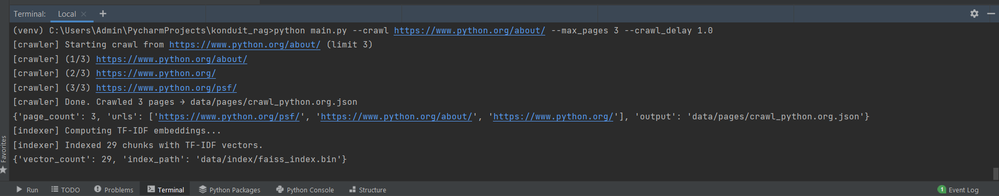
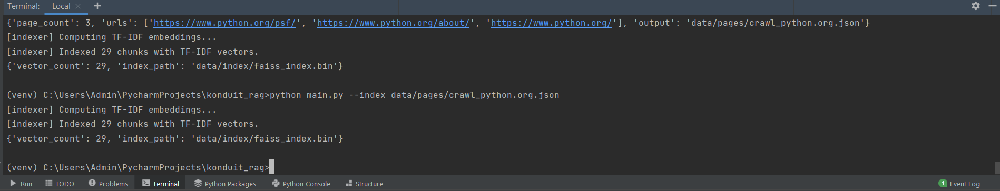
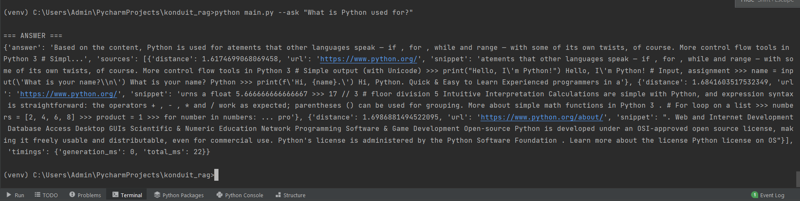
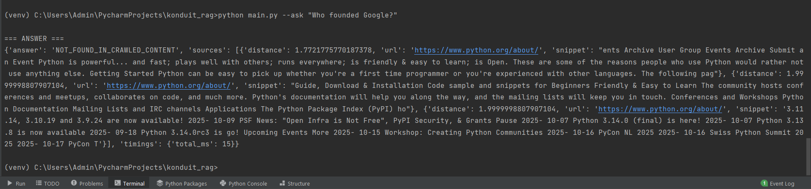

#  Konduit RAG (Retrieval Augmented Generation)

### Overview
This is a small RAG (Retrieval-Augmented Generation) project I built.  
The idea is to take a starting website URL, crawl its pages, collect the text, create a local index, and then answer questions **only** based on what was crawled.

It works fully **offline** using Python and open-source libraries.  
If there’s not enough information, it clearly says **“NOT_FOUND_IN_CRAWLED_CONTENT.”**

---

###  How It Works
1. **Crawl** – Goes through the website pages within the same domain.  
2. **Clean** – Extracts the readable text using BeautifulSoup.  
3. **Chunk + Index** – Splits text into smaller chunks and converts them to vector embeddings using **TF-IDF** (no online models needed).  
4. **Retrieve + Answer** – Finds the most relevant chunks when a question is asked, and gives an answer using the context.

---


---

### ️ Setup

```bash
# 1. Create a virtual environment
python -m venv venv
venv\Scripts\activate   # (Windows)
# or
source venv/bin/activate   # (Mac/Linux)

# 2. Install dependencies
pip install -r requirements.txt
How to Run:
Step 1: Crawl
(bash)
python main.py --crawl https://example.com --max_pages 5 --crawl_delay 1.0
This crawls up to 5 pages and saves the text in data/pages/.

Step 2: Index
(bash)
python main.py --index data/pages/crawl_example_com.json
This creates TF-IDF embeddings and stores them in data/index/.

Step 3: Ask Questions
(bash)
python main.py --ask "What does example.com say about documentation usage?"

Example Output:
csharp
Answer: Example.com is used for documentation examples without needing permission.
Source: https://example.com

If the system can’t find an answer:
makefile
Answer: NOT_FOUND_IN_CRAWLED_CONTENT 

Design Choices:
Used TF-IDF embeddings since it’s lightweight and works offline.
Limited crawling to a maximum of 30-50 pages (politeness + safety).
Added a small crawl delay so websites aren’t overloaded.
Used FAISS for quick similarity search.
If no strong match is found → system refuses to answer.

Example Run:
python main.py --crawl https://example.com --max_pages 5
python main.py --index data/pages/crawl_example_com.json
python main.py --ask "Who founded Google?"

Output:
makefile
Answer: NOT_FOUND_IN_CRAWLED_CONTENT

Tools Used:
Python 3.10
BeautifulSoup4
Requests
scikit-learn (TF-IDF)
FAISS (for vector search)
Transformers (for optional small LLM use)

Summary:
Fully working offline RAG pipeline
Simple CLI interface
Gives answers only when supported by crawled content
Clean refusal for unsupported queries
Easy to run and extend

Author: Nishant Namboodiri
Built in: PyCharm
Type: RAG / Offline Q&A Project

---

## 🧾 Example CLI Outputs (Screenshots)

Below are sample outputs from the demo run:

**1️⃣ Crawl Output**


**2️⃣ Index Output**


**3️⃣ Ask (Answerable)**


**4️⃣ Ask (Unanswerable)**

